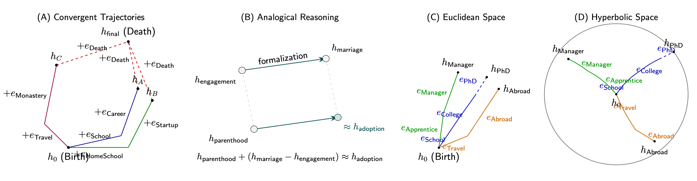

<div align="center">

# Event2Vector (event2vec)
## A Geometric Approach to Learning Composable Representations of Event Sequences

[](https://badge.fury.io/py/event2vector)
[](https://opensource.org/licenses/MIT)
[](https://www.python.org/downloads/)
[](https://arxiv.org/abs/2509.12188)

# 

</div>

## Overview

**Event2Vector** is a framework for learning representations of discrete event sequences. Inspired by the geometric structures found in neural representations, this model uses a simple, additive recurrent structure to create composable and interpretable embeddings.

## Key Concepts
* **Linear Additive Hypothesis**: The core idea behind Event2Vector is that the representation of an event sequence can be modeled as the vector sum of the embeddings of its individual events. This allows for intuitive vector arithmetic, enabling the composition and decomposition of event trajectories.
* **Euclidean and Hyperbolic Models**: Event2Vector is offered in two geometric variants:
    * **Euclidean model**: Uses standard vector addition, providing a straightforward, flat geometry for event trajectories.
    * **Hyperbolic model**: Employs Möbius addition, which is better suited for hierarchical data structures, as it can embed tree-like patterns with less distortion.

For more details, check *Sulc A., Event2Vector: A Geometric Approach to Learning Composable Representations of Event Sequences*

## Installation

Install the package directly from PyPI:

```bash
pip install event2vector
```

Or install from source:

```bash
git clone https://github.com/sulcantonin/event2vec_public.git
cd event2vec_public
pip install .
```


## Brown Corpus POS tagging example
After installation, you can try to run Brown Part-of-Speech tagging example from the paper. 

```bash
python3 -m experiments.prepare_brown_data.py
python3 -m experiments.train_brown_data.py
python3 -m experiments.visualize_brown_corpus.py
```

## Quickstart (tiny synthetic dataset)

The snippet below trains a small `EuclideanModel` on a toy event graph for a few epochs and prints an embedding for a short sequence. It runs in seconds on CPU.

We have 5 events: `START, A, B, C, END` and we test if we add `START + A + C ~ C`. The example should be self contained for educational purposes, as the main interest is the loss function. 

```python
import random
import torch
import numpy as np
from sklearn.decomposition import PCA
import matplotlib.pyplot as plt

# Reproducibility: fix all relevant seeds so results are stable across runs
SEED = 42
random.seed(SEED)                    # Python's RNG (used by get_sequences and shuffling)
np.random.seed(SEED)                 # NumPy RNG (used by PCA and any NumPy ops)
torch.manual_seed(SEED)              # Torch CPU RNG
if torch.cuda.is_available():
    torch.cuda.manual_seed_all(SEED) # Torch CUDA RNG (all devices)

# Optional: prefer deterministic behavior in cuDNN (may have performance impact)
torch.backends.cudnn.deterministic = True
torch.backends.cudnn.benchmark = False

# Expected results (for the tiny toy graph START→A/B→C→END):
# - Training loss should decrease over epochs (with minor wobble due to randomness/dropout).
# - The printed sequence embedding for [START, A, C] is a single 8-D vector (shape (1, 8)).
# - Nearest tokens by cosine similarity to that sequence embedding should rank 'C' highest
#   (since the encoder is additive and the last token is C), with 'END' somewhat aligned.
# - The decoder's top-1 next-event probability from that state should be 'END' with high
#   confidence (≈0.9+) because the toy transitions force C→END.
# Visualization (below): a 2D PCA of token embeddings plus the sequence embedding should show
# 'SEQ(START-A-C)' lying near the point labeled 'C'.

from event2vector import EuclideanModel
from event2vector.data import get_sequences

# 1) Define a tiny state-transition toy dataset
#    We model a simple Markovian process: START → (A or B) → C → END
#    The model will learn to predict the next token and produce a sequence embedding
#    by additive composition of token embeddings.
event_types = ['START', 'A', 'B', 'C', 'END']
event_transitions = {
    'START': [('A', 0.5), ('B', 0.5)],
    'A': [('C', 0.6), ('B', 0.4)],
    'B': [('C', 0.7), ('A', 0.3)],
    'C': [('END', 1.0)],
}

# 2) Generate synthetic sequences (reproducible thanks to the fixed seeds above)
#    get_sequences returns: raw sequences, tensorized sequences, and vocab mappings.
_, processed_sequences, event_2_idx, _ = get_sequences(
    event_types=event_types,
    event_transitions=event_transitions,
    initial='START',
    terminal='END',
    num_seq=200,            # generate 200 short sequences
    max_seq_length=6,       # keep them small for speed
    generate_new=True,
    prefix='tiny_quickstart'
)

# 3) Initialize model and optimizer
#    EuclideanModel composes sequence representations via additive updates.
device = 'cuda' if torch.cuda.is_available() else 'cpu'
embedding_dim = 8
model = EuclideanModel(num_event_types=len(event_types), embedding_dim=embedding_dim, dropout_p=0.1).to(device)
loss_fn = torch.nn.CrossEntropyLoss()              # prediction loss (next-token)
optimizer = torch.optim.AdamW(model.parameters(), lr=5e-3)
lambda_reconstruction = 0.2                        # weight for reconstruction loss (h1 - e ≈ h_old)
lambda_consistency = 0.2                           # weight for consistency loss (h1 ≈ h2)
mse_loss = torch.nn.MSELoss()

# 4) Minimal training loop
#    Objective: next-token prediction with cross-entropy.
#    We iterate tokens in each sequence and accumulate loss over (t → t+1) pairs.
model.train()
for epoch in range(128):
    random.shuffle(processed_sequences)  # shuffling is deterministic given the fixed Python seed
    total_loss = 0.0
    for seq_tensor in processed_sequences:
        if len(seq_tensor) < 2:
            continue
        # h is the running sequence representation; encoder adds current token embedding
        h = torch.zeros((1, embedding_dim), device=device)
        seq_tensor = seq_tensor.to(device)

        sequence_loss = 0.0
        for t in range(len(seq_tensor) - 1):
            x = seq_tensor[t].unsqueeze(0)
            target = seq_tensor[t + 1].unsqueeze(0)
            # Brown pipeline: two forward passes from the same h_old to compute a consistency loss
            h_old = h.detach()
            y1, h1, e_curr1 = model(x, h_old)
            y2, h2, e_curr2 = model(x, h_old)

            # Prediction: next-token cross-entropy on the first pass
            prediction_loss = loss_fn(y1.view(1, -1), target)

            # Reconstruction: undo the additive step (h1 - e ≈ h_old)
            h_reconstructed = h1 - e_curr1
            reconstruction_loss = mse_loss(h_reconstructed, h_old)

            # Consistency: two identical passes should produce similar states
            consistency_loss = mse_loss(h1, h2)

            combined = (prediction_loss +
                        lambda_reconstruction * reconstruction_loss +
                        lambda_consistency * consistency_loss)
            sequence_loss = sequence_loss + combined

            # Advance hidden state using the first pass
            h = h1.detach()

        if (len(seq_tensor) - 1) > 0:
            avg_seq_loss = sequence_loss / (len(seq_tensor) - 1)
            optimizer.zero_grad()
            avg_seq_loss.backward()
            optimizer.step()
            total_loss += avg_seq_loss.item()

    print(f"epoch {epoch + 1}: loss={total_loss / max(1, len(processed_sequences)):.4f}")

# 5) Use the learned representation for a short sequence
#    We encode [START, A, C] step-by-step; the final h is the sequence embedding.
model.eval()
with torch.no_grad():
    seq = torch.tensor([
        event_2_idx['START'], event_2_idx['A'], event_2_idx['C']
    ], device=device)
    h = torch.zeros((1, embedding_dim), device=device)
    for idx in seq:
        _, h, _ = model(idx.unsqueeze(0), h)
    print('Sequence embedding (START-A-C):', h.cpu().numpy())


with torch.no_grad():
    # 6) Qualitative check: nearest tokens to the sequence embedding by cosine similarity
    #    Expect 'C' to be nearest (last consumed token) and 'END' reasonably aligned.
    emb = model.embedding.weight.detach()                  # [V, 8]
    h_norm = torch.nn.functional.normalize(h, dim=1)
    emb_norm = torch.nn.functional.normalize(emb, dim=1)
    sims = (emb_norm @ h_norm.squeeze(0))
    top_sim = torch.topk(sims, k=3)
    print('Nearest tokens by cosine:', [ (list(event_2_idx.keys())[i], float(sims[i])) for i in top_sim.indices ])

with torch.no_grad():
    # 7) Next-event distribution from the current state
    #    Expect 'END' to be top-1 with high probability because C→END with p=1.0
    logits = model.decoder(h)                              # [1, V]
    probs = torch.softmax(logits, dim=-1).squeeze(0)
    top = torch.topk(probs, k=3)
    inv = {v:k for k,v in event_2_idx.items()}
    print('Top-3 next events:', [ (inv[i.item()], float(probs[i])) for i in top.indices ])

# 8) Visualization: PCA of token embeddings + sequence embedding
#    Expect the red star (sequence) to lie near the point labeled 'C'.
with torch.no_grad():
    token_emb = model.embedding.weight.detach().cpu().numpy()   # [V, 8]
    seq_emb = h.detach().cpu().numpy()                           # [1, 8]
    X = np.vstack([token_emb, seq_emb])
    pca = PCA(n_components=2, random_state=SEED)
    X2 = pca.fit_transform(X)
    tokens2, seq2 = X2[:-1], X2[-1]

inv = {v:k for k,v in event_2_idx.items()}
plt.figure(figsize=(6, 6))
plt.scatter(tokens2[:, 0], tokens2[:, 1], c='gray', label='tokens')
for i, (x, y) in enumerate(tokens2):
    plt.text(x + 0.02, y + 0.02, inv[i], fontsize=9)
plt.scatter([seq2[0]], [seq2[1]], c='red', marker='*', s=160, label='SEQ(START-A-C)')
plt.title('PCA: token embeddings + sequence embedding (expect SEQ near C)')
plt.legend(loc='best')
plt.tight_layout()
plt.show()
```

## References
For citations please use following Bibtex. 
```bibtex
@article{sulc2025event2vec,
  title={Event2Vec: A Geometric Approach to Learning Composable Representations of Event Sequences},
  author={Sulc, Antonin},
  journal={arXiv preprint arXiv:2509.12188},
  year={2025}
}
```
